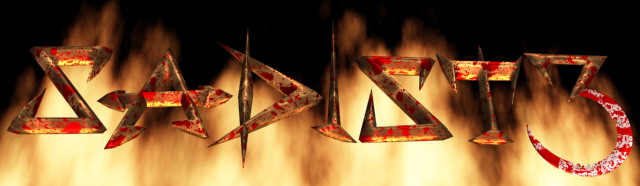

# Sadist 3: Prawdziwi zabójcy - demo

(eng. Sadist 3: The True Killers)

Copyright 2012 Zombie Mastah (https://gadz.pl)

Created by Grzegorz Drozd

This is the unfinished third part of the game **Sadist**. I started it several years after Sadist 2 and spent many months working on it. But after some personal causes I was too tired to finish it and left if for another several years. After that time I had an idea to release it unfinished but I was sure I will never finish it. So, now I figured out that I could release all the sources I created. Maybe someone will just look at it. Or maybe someday someone will try to change or add something, compile it again, make it a bit better... Well, I don't think so...

It would be also great idea to recreate it as Sadist 4, use a better modern technology and make it all over again. This is my little dream...

# Website

The 'Sadist 3' website is available at https://gadz.pl/sadist-3
You can download working game there, find some videos, screenshots, descriptions etc.

A video gameplay is here: https://www.youtube.com/watch?v=98r0f8bTgcM

# Compilation

Sadist 3 is created in Borland Delphi by Borland International Inc./Embarcadero Technologies, Inc.

I know it would be hard to compile the sources in the most recent version of Delphi. Some fixes would be needed, so it's not an easy task. 
Also, I used some third party libraries and components. I shouldn't redistribute it because it's not my property. But all of them are free and I used very old versions (it was almost 20 years ago!). So it's almost impossible to find today these components in used here old versions. That's why I decided to add these components into my repository, to give someone a possibility to just compile the code. All of them has descriptions with copyrights, licences and authors, if it was mentioned in included files. Some parts of these components are changed by me because I needed it.

So... if you're an author of any of these components and you think I should remove it from this repo, please send me a message and I will do it immediately. I don't want to steal your work, I didn't earn a single penny on this game. All my games are freeware.

All needed source files should be included in this repositiory. Main file to start is `Project1.dpr` (haha, that's right!). There are also additional tools in separate folders.

## Third party components

- Audiere Sound System
  
    Version 1.9.2

    (c) 2002 Chad Austin

- OpenAL cross platform audio library
  
    Copyright (C) 1999-2000

    All authors are mentioned in the source files

- Cosin (I renamed it to sinusy.pas)

    Copyright by BinBoy

    http://www.free.com.pl/binboy

- PowerDraw v3.0 Pre-Release 3
  
    Written by Lifepower (lifepower@fromru.com)

    This one is edited by me. I adapted it to a bit newer version of Delphi and added some fixes. I don't have the original sources :(

    I included a zipped folder with all files I had from this library. You should unzip it and include to the project.

# The code

This is a Polish game. I was creating it when I was young and still learning to code, so this code is not top quality. Almost all variable and type names are Polish, so it could be hard to understand for foreigners. You'll see also there is a big mess in the code, ugly formatting etc. Sorry, it was my fault. You may believe me, but today I do code reviews to other programmers at work and I don't allow anyone to type like this what is here! BUT! All of this shows how a man learns and develop his skills.

I don't change anything in this code now. It's as it looked like many years ago. You can see now what can happen when you don't keep your code clean. The whole project will collapse and you will stay under all these trash. 

# The purpose of this repositiory

Do what do you want with this code. Maybe you'll learn, maybe have fun. Maybe you'll fix something or change. The only thing I wouldn't like you to do is changing the credits for my game and release it anywhere. Please, keep in mind, it was my game and I sacrificed many months of work on it. And it all was always free. I deserve credit for this game and this code. Even if it's not the best quality. Thanks.

Grzegorz "GAD" Drozd, vel GadZombie
